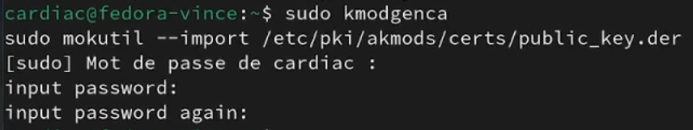
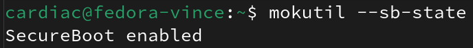

# Guide Fedora

1. [Préparation du système](#1-préparation-du-système)
2. [Optimisation de DNF](#2-optimisation-de-dnf)
3. [Configuration des dépôts](#3-configuration-des-dépôts)
4. [Mise à jour des firmwares](#4-mise-à-jour-des-firmwares)
5. [Configuration des pilotes graphiques NVIDIA](#5-configuration-des-pilotes-graphiques-nvidia)
6. [Secureboot](#6-secureboot)
7. [Configuration AMD et Intel](#7-configuration-amd-et-intel)
8. [Configuration multimédia](#8-configuration-multimédia)
9. [Ajout de polices](#9-ajout-de-polices)
10. [Ajout d'extensions pour GNOME](#10-ajout-dextensions-pour-gnome)
11. [Installation des outils de compression](#11-installation-des-outils-de-compression)
12. [Installation d'applications diverses](#12-installation-dapplications-diverses)
13. [Intelligence Artificielle](#13-intelligence-artificielle)

<br>

## 1. Préparation du système
Mettre à jour Fedora : Avant de commencer toute configuration, assurez-vous que votre système est à jour. Utilisez la commande suivante :
  ```bash
  sudo dnf check-update --refresh
  ```
  Si des mises à jour sont disponibles, appliquez-les avec :
  ```bash
  sudo dnf upgrade
  ```

<br>

## 2. Optimisation de DNF
- Activation de `fastestmirror` pour sélectionner le miroir le plus rapide, augmentation de `max_parallel_downloads` à 10 pour les téléchargements simultanés, et activation de `countme` pour aider Fedora à collecter des statistiques anonymes sur l'utilisation des paquets.
  ```bash
  echo 'fastestmirror=true' | sudo tee -a /etc/dnf/dnf.conf
  echo 'max_parallel_downloads=10' | sudo tee -a /etc/dnf/dnf.conf
  echo 'countme=true' | sudo tee -a /etc/dnf/dnf.conf
  ```

<br>

## 3. Configuration des dépôts
- **Ajouter le dépôt Flathub pour Flatpak** :
Cette action n'est pas utile sur **Fedora Workstation** ou **Silverblue** si  vous avez cocher la case "ajout des dépots tiers" en post installation.
  ```bash
  flatpak remote-add --if-not-exists flathub https://dl.flathub.org/repo/flathub.flatpakrepo
  ```
  
- **Installer les dépôts RPM Fusion (libres et non libres)** :
  ```bash
  sudo dnf install -y https://mirrors.rpmfusion.org/free/fedora/rpmfusion-free-release-$(rpm -E %fedora).noarch.rpm https://mirrors.rpmfusion.org/nonfree/fedora/rpmfusion-nonfree-release-$(rpm -E %fedora).noarch.rpm
  ```
- **Ajout Appstream metadata de rpmfusion**
  ```bash
  sudo dnf update -y @core
  ```

<br>

## 4. Mise à jour des firmwares
Utilisation de `fwupdmgr` pour la mise à jour des firmwares :

```bash
sudo fwupdmgr refresh --force && \
sudo fwupdmgr get-updates && \
sudo fwupdmgr update
```

<br>

## 5. Configuration des pilotes graphiques NVIDIA
- **Installation des pilotes NVIDIA et support CUDA** :
  ```bash
  sudo dnf install -y akmod-nvidia
  sudo dnf install -y xorg-x11-drv-nvidia-cuda
  ```
- **Installation de Vulkan** :
  ```bash
  sudo dnf install -y vulkan
  ```
- **Support ffmpeg avec NVENC/NVDEC (CUDA)** :
  ```bash
  sudo dnf install -y xorg-x11-drv-nvidia-cuda-libs
  ```
- **Support de VDPAU/VAAPI** :
  ```bash
  sudo dnf install -y libva-nvidia-driver.{i686,x86_64} libva-utils vdpauinfo
  ```

<br>

## 6. Secureboot

**Le secureboot fonctionne très bien sur Fedora sans faire ce qui suit, ce qui suit n'est utile que avec les drivers Nvidia propriétaires ou autre DKMS.**

Le Secureboot est une fonctionnalité de sécurité du firmware UEFI qui assure que seuls les logiciels autorisés peuvent être lancés au démarrage de l'ordinateur, empêchant ainsi le chargement de logiciels malveillants.

Installation des dépendances nécessaires au Secure Boot :
```
sudo dnf install -y kmodtool akmods mokutil openssl
```
Génération de votre clé :

 ```
sudo kmodgenca
sudo mokutil --import /etc/pki/akmods/certs/public_key.der
```

À cette étape on va vous demander un mot de passe à usage unique qu'il faudra entrer une seule fois au reboot. Celui-ci ne servira plus jamais et n'a aucune influence sur le niveau de sécurité. Mettez donc un mot de passe très simple surtout qu'au redémarrage, au moment de saisir le mot de passe, vous serez en qwerty et non en azerty. Vous pouvez même mettre une seule lettre, en pensant bien que au redémarrage vous êtes en qwerty donc si vous mettez `a` faudra mettre `q`.



Après cela, nous redémarrons, activons le Secure Boot dans le BIOS, et nous serons accueillis par un bel écran bleu. Il faudra alors procéder comme suit, regardez la vidéo : **[Cliquez pour voir la vidéo](Images/enroll-after-reboot.mp4)**

- Enroll MOK
- Continue 
- Se rappeler que on est en qwerty et pas azerty
- Entrer le mot de passe à utilisation unique choisi précédemment.

Pour vérifier que le sécureboot est actif : `mokutil --sb-state`



---

## 7. Configuration AMD et Intel

Remplacement des pilotes Mesa :

- Exécutez les commandes suivantes pour remplacer les pilotes standards par les versions freeworld :
  ```bash
  sudo dnf swap -y mesa-va-drivers mesa-va-drivers-freeworld
  sudo dnf swap -y mesa-vdpau-drivers mesa-vdpau-drivers-freeworld
  ```
- Pour les utilisateurs de Steam ou d'autres applications nécessitant une compatibilité 32 bits, installez également les versions i686 :
  ```bash
  sudo dnf swap -y mesa-va-drivers.i686 mesa-va-drivers-freeworld.i686
  sudo dnf swap -y mesa-vdpau-drivers.i686 mesa-vdpau-drivers-freeworld.i686
  ```

#### Intel seulement

Pour les GPU Intel, l'installation du pilote `intel-media-driver` est essentielle pour l'encodage et le décodage vidéo matériel, ce qui permet une gestion efficace des tâches multimédias.

  ```bash
  sudo dnf install -y intel-media-driver
  ```

#### AMD seulement

ROCm est une plateforme de calcul ouvert optimisée pour les GPU AMD. Elle est utile pour les tâches de calcul intensif telles que le traitement d'image, la science des données et le deep learning.

   - Installez ROCm avec les commandes suivantes :
     ```bash
     sudo dnf -y install rocm-opencl rocminfo rocm-clinfo rocm-hip rocm-runtime rocm-smi rocm-hip-devel
     ```

<br>

## 8. Configuration multimédia
- **Installation des codecs multimédia** pour une meilleure compatibilité :
  ```bash
  sudo dnf swap -y ffmpeg-free ffmpeg --allowerasing
  sudo dnf groupupdate -y multimedia --setopt='install_weak_deps=False' --exclude=PackageKit-gstreamer-plugin
  sudo dnf groupupdate -y sound-and-video
  ```

<br>

## 9. Ajout de polices

- **Installation des polices Microsoft et d'autres polices pour une meilleure compatibilité bureautique** :
  ```bash
  sudo dnf install -y curl cabextract xorg-x11-font-utils fontconfig
  sudo rpm -i https://downloads.sourceforge.net/project/mscorefonts2/rpms/msttcore-fonts-installer-2.6-1.noarch.rpm
  sudo dnf install -y 'google-roboto*' 'mozilla-fira*' fira-code-fonts dejavu-fonts-all liberation-fonts google-noto-emoji-fonts google-noto-color-emoji-fonts google-noto-sans-fonts google-noto-serif-fonts 'adobe-source-code*'
  ```
  
<br>

## 10. Ajout d'extensions pour GNOME

Pour enrichir l'expérience utilisateur sur l'environnement de bureau GNOME, l'installation de certaines extensions peut être très utile. Voici comment installer et activer une variété d'extensions GNOME utiles :

- **Installation des outils et extensions GNOME** :
  ```bash
  sudo dnf install -y gnome-tweaks gnome-extensions-app
  ```

- **Activer les extensions essentielles** :
  - **AppIndicator et KStatusNotifierItem Support** pour intégrer les indicateurs d'application dans la barre supérieure.
    ```bash
    gnome-extensions enable appindicatorsupport@rgcjonas.gmail.com
    ```
  - **Caffeine** pour désactiver la mise en veille automatique.
    ```bash
    sudo dnf install -y gnome-shell-extension-caffeine
    gnome-extensions enable caffeine@patapon.info
    ```
  - L'extension **GameMode** indique si gamemode est en cours d'utilisation (nécessite d'avoir gamemode installé)
    ```bash
    sudo dnf install -y gnome-shell-extension-gamemode
    gnome-extensions enable gamemode@christian.kellner.me
    ```
  - **GSConnect** pour intégrer votre appareil Android avec votre bureau GNOME.
    ```bash
    sudo dnf install -y gnome-shell-extension-gsconnect
    gnome-extensions enable gsconnect@andyholmes.github.io
    ```

- **Configuration des extensions** :
  - Pour activer les extensions système pour tous les utilisateurs, vous pouvez configurer les extensions à l'aide de dconf. Voici un exemple de configuration :
    ```bash
    cat <<EOF | sudo tee /etc/dconf/db/local.d/00-extensions
    [org/gnome/shell]
    # List all extensions that you want to have enabled for all users
    enabled-extensions=['appindicatorsupport@rgcjonas.gmail.com', 'caffeine@patapon.info', 'gamemode@christian.kellner.me', 'gsconnect@andyholmes.github.io']
    EOF
    sudo dconf update
    ```

<br>    

## 11. Installation des outils de compression
- **Installation des outils de compression pour gérer divers formats d'archives** :
  ```bash
  sudo dnf install -y p7zip p7zip-plugins unrar unace lha
  ```

<br>

## 12. Installation d'applications diverses

- **OpenRGB** :
  - OpenRGB permet de contrôler l'éclairage RGB de nombreux périphériques et composants informatiques. Il offre une interface unifiée pour gérer les configurations RGB sans dépendre de logiciels spécifiques au fabricant.
    ```bash
    sudo dnf install -y openrgb
    ```

- **Fastfetch** :
  - Fastfetch est un outil similaire à Neofetch, mais avec plus de personnalisation et des performances optimisées. Il affiche les détails du système d'une manière visuellement attrayante directement dans le terminal.
    ```bash
    sudo dnf install -y fastfetch
    ```

- **Bloqueur de pub/malwares pour Firefox (uBlock Origin)** :
  - uBlock Origin est une extension pour Firefox efficace pour bloquer les publicités et les malwares, améliorant ainsi la vitesse et la sécurité de la navigation.
    ```bash
    sudo dnf install -y mozilla-ublock-origin
    ```

- **Gestion des droits des Flatpaks (Flatseal)** :
  - Flatseal est une application graphique qui permet aux utilisateurs de gérer facilement les permissions des applications Flatpak sur leur système.
    ```bash
    sudo dnf install -y flatseal
    ```

- **GameMode** :
  - GameMode est un démon système conçu pour optimiser automatiquement les paramètres de performance du système Linux lors de l'exécution de jeux vidéo, améliorant ainsi les performances du CPU et du GPU pour les jeux.
    ```bash
    sudo dnf install -y gamemode
    ```

- **Btrfs Assistant** :
  - Btrfs Assistant est un outil graphique qui facilite la gestion des systèmes de fichiers Btrfs, offrant des fonctionnalités comme la création et la gestion de sous-volumes, de snapshots et de rebalances.
    ```bash
    sudo dnf install -y btrfs-assistant
    ```
## 13. Intelligence Artificielle

### Pour les cartes AMD

Installation de dépendances :
```bash
sudo dnf install hipblas
```
Selon la génération de votre carte graphique,, il faudra définir une variable d'environnement particulière :
| Génération du GPU | Variable d'environnement |
| ---    | ---   |
| GCN 5e gen APUs | `HSA_OVERRIDE_GFX_VERSION=9.0.0` |
| RDNA 1 (RX 5000) | `HSA_OVERRIDE_GFX_VERSION=10.1.0` |
| RDNA 2 (RX 6000) | `HSA_OVERRIDE_GFX_VERSION=10.3.0` |
| RDNA 3 (RX 7000) | `HSA_OVERRIDE_GFX_VERSION=11.0.0` |

Par exemple pour une RADEON RX 7900 XTX :
```bash
echo "export HSA_OVERRIDE_GFX_VERSION=11.0.0" >> .bash_profile
. .bash_profile
```

#### Installation d'Ollama
```bash
curl -L https://ollama.com/download/ollama-linux-amd64.tgz -o ollama-linux-amd64.tgz

sudo tar -C /usr -xzf ollama-linux-amd64.tgz

curl -L https://ollama.com/download/ollama-linux-amd64-rocm.tgz -o ollama-linux-amd64-rocm.tgz

sudo tar -C /usr -xzf ollama-linux-amd64-rocm.tgz

sudo useradd -r -s /bin/false -U -m -d /usr/share/ollama ollama

sudo usermod -a -G ollama $(whoami)

sudo usermod -a -G render ollama

sudo usermod -a -G video ollama

cat <<EOF | sudo tee /etc/systemd/system/ollama.service >/dev/null
[Unit]
Description=Ollama Service
After=network-online.target

[Service]
ExecStart=/usr/bin/ollama serve
User=ollama
Group=ollama
Restart=always
RestartSec=3
Environment="PATH=$PATH"

[Install]
WantedBy=default.target
EOF

sudo systemctl daemon-reload

sudo systemctl enable ollama

sudo systemctl restart ollama

systemctl status ollama
```

Installer et tester llama3.2 :
```bash
ollama run llama3.2
```

#### Installer l'interface Open WebUI
```bash
podman run --replace -d --network=host -v open-webui:/app/backend/data -e OLLAMA_BASE_URL=http://127.0.0.1:11434 --name open-webui --restart always ghcr.io/open-webui/open-webui:main
```

L'interface Open WebUI est accessible dans un navigateur en local à cette adresse :
[http://localhost:8080](http://localhost:8080)
